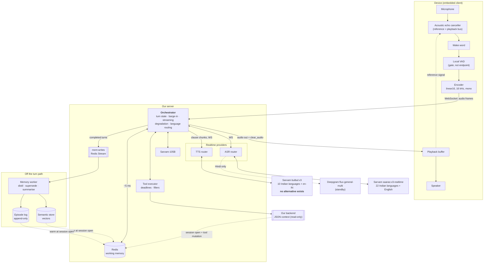
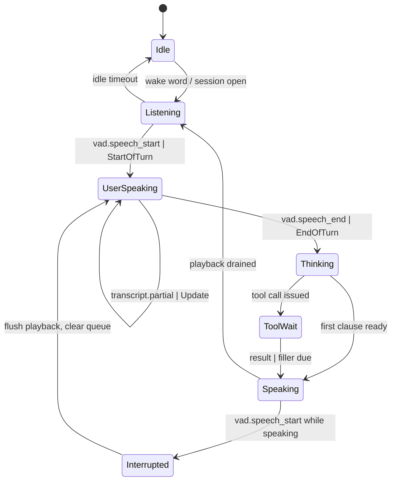
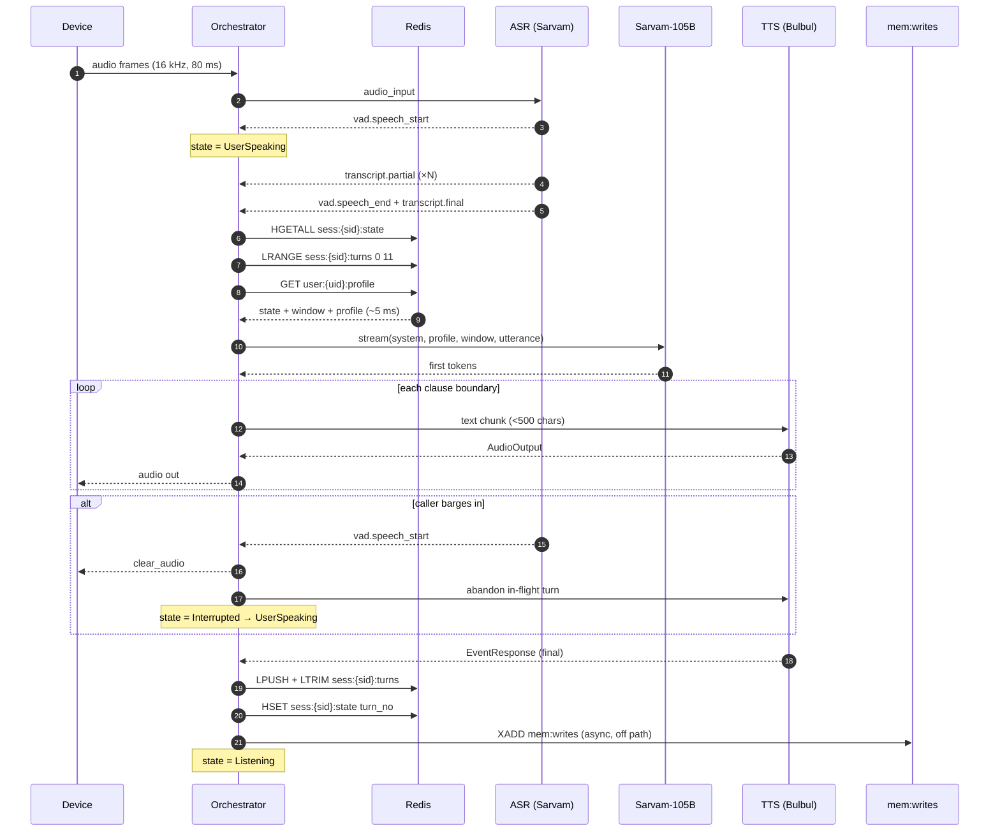

# 01 — Architecture

A multilingual companion bot on a dedicated device, with memory continuity across days and
weeks, and free language switching on any turn.

Every provider-specific claim here is sourced in
[00-provider-research.md](00-provider-research.md). Where this document departs from the
originally proposed architecture, it says so and why.

---

## 1. Three context layers, deliberately separate

The central discipline of this design is that three different kinds of state are kept
apart, because they have different owners, different lifetimes and different latency
budgets. Collapsing them is the most common way voice agents become unmaintainable.

| Layer | What it is | Owner | Lifetime | On the turn path? |
|---|---|---|---|---|
| **JSON context** | User data from our own backend — identity, account, entitlements, history | Backend, authoritative | Fetched at session open; refreshed only when a tool mutates it | Read from Redis cache only |
| **Redis** | Short-term working memory — session state, recent turns, in-flight tools | Orchestrator | Session + idle window | **Yes**, ~5 ms budget |
| **Long-term memory** | Semantic (vector) + longitudinal (append-only event log) | Memory worker | Permanent, with soft deletes | **No** by default — warmed into Redis at session open |

**JSON context is not memory.** It is read-only to the agent and authoritative from the
backend. The agent never writes to it; a tool call mutates it through the backend, and the
cache is then invalidated. Treating it as memory is how entitlement bugs become
conversational bugs.

**Long-term memory is not queried per turn.** It is warmed into Redis at session open, and
queried live only on explicit recall intent. Under strong continuity this layer carries the
product — see §7.

---

## 2. Component diagram

Solid edges are on the turn's critical path. Dotted edges are warm-up, reference signals or
asynchronous writes.

---

## 3. Stage-by-stage responsibilities

### 3.1 Device audio front-end

Owned entirely by us. No provider offers any of this — both providers' barge-in designs
assume a telephony leg where the carrier already cancelled echo
([§7.2](00-provider-research.md#72-barge-in-on-an-open-air-device-is-an-echo-problem-the-docs-do-not-address)).

| Component | Responsibility | Note |
|---|---|---|
| **AEC** | Remove our own playback from the mic signal, using the playback bus as reference | **The highest-risk component in the system.** Without it the ASR transcribes the bot and every utterance self-interrupts |
| **Wake word** | Gate the session open | Keeps sockets closed while idle — matters given Sarvam's concurrency limits |
| **Local VAD** | Cheap gate to avoid streaming silence | **Not** the endpointer. Turn detection belongs to the server; a local VAD that also endpoints will fight the provider's |
| **Encoder** | `linear16`, **16 kHz**, mono | Forced: the Sarvam realtime socket accepts only 8000 or 16000 and closes with code `4000` otherwise |

### 3.2 Transport

A single WebSocket per session, device to our server. Audio frames up, audio and control
messages down.

The device never holds provider credentials. Sarvam's own guidance for client-facing
apps applies to us directly: keep secrets server-side and proxy the WebSocket through the
backend ([deploy with code](https://docs.sarvam.ai/conversations/deploy/deploy-with-code)).

Frame cadence: Deepgram recommends 80 ms chunks
([Flux quickstart](https://developers.deepgram.com/docs/flux/quickstart.md)); Sarvam
publishes no recommendation. Use 80 ms for both until measured.

### 3.3 ASR router

Chooses the provider and model per session, and can re-configure mid-stream.

- **Default and effectively sole provider: Sarvam `saaras:v3-realtime`.** The only model the
  realtime socket accepts. Covers all 22 Indian languages plus English.
- **Deepgram `flux-general-multi` is a Hindi-only standby.** It is the sole Indic language
  the model reaches, so it can cover a Sarvam ASR outage for Hindi sessions and nothing else
  ([§7.1b](00-provider-research.md#71b-fail-over-to-the-other-provider-survives-for-exactly-one-language)).
  It does bring `word.confidence` and word-level timestamps, which Sarvam does not.
- **The speakability gate lives here, not in the TTS router.** On resolving a language, check
  it against Bulbul's 11-language set before opening the turn loop. Twelve Indian languages
  transcribe cleanly and cannot be answered.
- **Language switching** is handled in-stream, not by reconnecting: Sarvam takes
  `config.update`, Deepgram Flux takes a mid-stream `Configure` for `language_hint`. A
  mid-session switch **into** an unspeakable language must be caught the same way as at open.

**Open dependency:** whether the auto-detect token on `saaras:v3-realtime` is `auto` or
`unknown` — three Sarvam pages disagree
([§7.4](00-provider-research.md#74-free-per-turn-language-switching-is-real--but-our-evidence-is-one-layer-above-our-api)).
Resolve empirically before building the switching path.

### 3.4 Endpointing and turn detection

Server-side, off the provider's own events.

- **Sarvam:** `vad.speech_start` / `vad.speech_end`, tuned with `threshold`,
  `silence_duration_ms`, `min_speech_duration_ms`. No defaults are published — these must be
  derived empirically. Sarvam's managed product exposes them only as qualitative sliders
  ("Sound sensitivity" Low–High, "Eagerness to respond" Patient–Eager).
- **Deepgram:** the Flux state machine — `StartOfTurn` → `EagerEndOfTurn` →
  (`TurnResumed` | `EndOfTurn`), with `eot_threshold` (0.5–1.0, default 0.7),
  `eager_eot_threshold` (0.3–0.9, default unset) and `eot_timeout_ms` (500–60000, default
  5000).

The orchestrator normalises both into one internal turn state machine (§4) so the rest of
the pipeline is provider-agnostic.

### 3.5 Orchestrator

Owns everything the bundled agent APIs would have given us and that we gave up by rolling
our own ([ADR 0001](adr/0001-orchestrator.md)):

- Turn state machine and its transitions
- Barge-in detection and playback flush
- Clause-boundary chunking into the TTS socket
- **Sarvam TTS keepalive** — `ping` before the ~1 minute idle auto-close
- Reconnect and resume across long idle companion stretches
- Language routing and mid-stream reconfiguration
- Degradation and failover (§6)
- Redis reads and writes; emitting to `mem:writes`

### 3.6 LLM

**Sarvam-105B** ([ADR 0003](adr/0003-llm.md)). Streamed, so the orchestrator can begin
synthesising at the first clause boundary rather than at completion.

The prompt is assembled from Redis only: session state, the last 8–12 turns, and the
distilled profile. Long-term memory reaches the prompt through the profile, not through a
per-turn query.

**Hard constraint:** 40 req/min on Starter, 60 on Pro, 120 on Business. This is the
system's concurrency ceiling — lower than the ASR socket limit
([§7.8](00-provider-research.md#78-the-llm-is-the-concurrency-ceiling-not-the-asr)).

### 3.7 Tools

Tools mutate the world and the JSON context. The contract is in
[02-data-contracts.md](02-data-contracts.md).

Each call carries a deadline. Anything projected beyond ~500 ms gets a spoken filler while
it runs. On completion the orchestrator clears the pending entry and invalidates
`user:{uid}:ctx`.

### 3.8 TTS router

Keyed on the **TTS voice matrix** — never on "is this an Indian language". Those are
different sets, and the difference is 12 languages
([§7.1](00-provider-research.md#71-the-stack-hears-22-indian-languages-and-speaks-10)).

**The supported language set — the whole product, definitively:**

| # | Language | Code | | # | Language | Code |
|---|---|---|---|---|---|---|
| 1 | Hindi | `hi-IN` | | 7 | Malayalam | `ml-IN` |
| 2 | Bengali | `bn-IN` | | 8 | Marathi | `mr-IN` |
| 3 | Tamil | `ta-IN` | | 9 | Punjabi | `pa-IN` |
| 4 | Telugu | `te-IN` | | 10 | Odia | `or-IN` |
| 5 | Gujarati | `gu-IN` | | 11 | English (Indian) | `en-IN` |
| 6 | Kannada | `kn-IN` | | | | |

All eleven route to **Sarvam `bulbul:v3`**. There is no second provider — Bulbul is a single
point of failure for every session ([ADR 0005](adr/0005-tts-provider-split.md)).

**Everything else is refused at session open**, including the 12 Indian languages Saaras
transcribes but Bulbul cannot speak: `ur-IN`, `as-IN`, `ne-IN`, `kok-IN`, `ks-IN`, `sd-IN`,
`sa-IN`, `sat-IN`, `mni-IN`, `brx-IN`, `mai-IN`, `doi-IN`.

**Scoping them out does not remove the failure mode.** Saaras will still transcribe those 12
accurately, and the LLM will still reason over them — the absence only appears at synthesis.
**The gate belongs in the ASR router**, keyed on this table, not at the TTS boundary where it
fires far too late.

→ Full build specification: **[06-speakability-gate.md](06-speakability-gate.md)**. Note that
it fires at **three** points, not one — with auto-detection the language is unknown at session
open, so the authoritative check lands on the first transcript, before the LLM call.

Text is fed in clause-sized chunks — Sarvam recommends under 500 characters per message
for streaming, with a hard cap of 2500.

Output is **24 kHz**: Bulbul streaming is capped there, and it is well above what a
device speaker needs.

### 3.9 Memory writer

Off the turn path. Consumes `mem:writes`, distils facts and episode summaries, writes to
the semantic and longitudinal stores, supersedes older facts and soft-deletes them with a
timestamp.

Under strong continuity this worker's lag is a **user-visible quality metric**, not just
queue health — see §7.

---

## 4. Turn state machine

Provider events normalised into one internal model.

`Speaking → Interrupted` is the barge-in edge, and it is the one that depends on AEC
working. If the canceller leaks, the bot's own audio triggers `vad.speech_start` and the
agent interrupts itself in a loop.

---

## 5. Sequence for one full turn

**Points worth noting in that sequence.** Redis is read once, in one pipelined round trip —
not three. The first TTS chunk is dispatched at the first clause boundary, not at LLM
completion, which is what makes the latency budget conceivable at all. And the
`mem:writes` append is fire-and-forget: a failure there degrades tomorrow's conversation,
never today's turn.

---

## 6. Degradation

Policy — which failures are spoken, which are absorbed, and how that is decided — is
[ADR 0008](adr/0008-degradation-policy.md). The one-line version: **only a failure that ends
the session is ever announced to the user.** Everything else is logged and survived, because a
companion narrating its own infrastructure is worse than one that is quietly a little thinner
for an evening — and going silent with no explanation is worse than either.

| Failure | Response | Feasibility |
|---|---|---|
| Low ASR confidence | Targeted reprompt naming the uncertain slot | **Not implementable as specified on Sarvam** — no ASR confidence field is documented. Substitute: LLM-side slot uncertainty, or a confirmation policy on high-stakes slots. See [05](05-open-questions.md) |
| ASR provider timeout | Reconnect first; fail over to Deepgram `flux-general-multi` from the second consecutive failure | **`hi-IN` and `en-IN` only**; the other 9 have no second ASR. **Off by default** — Deepgram has no India region, so failover relocates audio out of the country ([ADR 0008 §6](adr/0008-degradation-policy.md)) |
| **TTS outage** | **No failover exists.** Pre-rendered holding audio, then graceful close | Accepted single point of failure for every session ([ADR 0005](adr/0005-tts-provider-split.md)) |
| Unspeakable language detected at open | Refuse in a language we *can* speak, do not start | The 12 heard-but-unspeakable languages. There is no voice to apologise in afterwards |
| Mid-session switch into an unspeakable language | Continue in the previous language, acknowledge the limit once | The user may switch to Urdu mid-conversation. Silence is the failure mode to avoid |
| Redis down | Continue stateless on JSON context only. No turn window, no profile | The companion becomes shallow but stays alive. **Behind a circuit breaker** — otherwise the outage costs a connect timeout on every call of every turn, and a dependency outage becomes a latency outage |
| Tool failure | Spoken fallback; clear the `sess:{sid}:pending` entry | — |
| LLM 429 | Jittered backoff, bounded by a 2.5 s budget; filler once the silence is real; retries stop at the first streamed chunk | Expected under load — this is the binding limit, and it is **per account**, so it trips for every live session at once |
| LLM unreachable for 3 consecutive turns | Say so once, then close | A single lost turn is answered and survived; three is not a conversation |
| TTS socket idle-closed | Reconnect transparently before the next chunk; **discard queued speech older than 3 s** | Sarvam closes after ~1 min idle; likely during companion pauses. Speaking stale text answers a question the user has moved past |
| `mem:writes` unavailable | Bounded in-process buffer; overflow drops the oldest low-priority event and counts it | Resolves [Q7](05-open-questions.md#q7-does-memwrites-get-buffered-during-a-redis-outage-or-is-the-gap-accepted). The backlog does not survive a crash — accepted, not hidden |

---

## 7. What the companion shape changes

The originally proposed architecture was shaped around a phone call. Three assumptions do
not survive the move to a device-resident companion, and they are corrected throughout
these documents rather than patched over.

**Session lifetime.** "TTL = expected call length + buffer" assumes a call that ends.
A companion session is an idle window that may span an evening, punctuated by silence. TTLs
become idle-based, and `user:{uid}:profile` stops being session-scoped and becomes a durable
cache with explicit invalidation. See [02-data-contracts.md](02-data-contracts.md).

**Memory writer criticality.** Keeping the writer off the *turn* path is correct. But under
strong continuity, "eventually consistent" means a companion that forgets what you told it
an hour ago. Consumer lag needs an SLO and an alarm, not just a queue depth chart.

**Language as preference, not lock.** The original rule — one correction in the first two
turns, then locked — is dropped. `session.language` becomes a per-turn observed value plus a
sticky preference on the user profile. Both providers support mid-stream reconfiguration, so
this is mechanically available; what is unresolved is whether the *voice* survives the switch
([§7.3](00-provider-research.md#73-voice-identity-across-a-language-switch-is-undocumented)).

---

## 8. Non-goals

Stated so they are not quietly designed in later:

- **No non-Indic languages.** Scope is Hindi, Hinglish and Indian languages. Deepgram's
  Aura-2 (`es`, `de`, `fr`, `nl`, `it`, `ja`) is therefore unused; Deepgram remains only as
  a Hindi ASR standby.
- **No support for the 12 Indian languages Bulbul cannot speak** — Urdu, Assamese, Nepali,
  Konkani, Kashmiri, Sindhi, Sanskrit, Santali, Manipuri, Bodo, Maithili, Dogri. No voice
  exists in either provider, and we decided against adding a second TTS vendor or translating
  into a speakable language ([ADR 0005](adr/0005-tts-provider-split.md)). **Urdu is the
  accepted loss.**
- **No telephony.** No SIP, no PSTN, no 8 kHz path, no carrier echo cancellation to inherit.
- **No speech-to-speech model.** Neither provider offers one for Indic languages
  ([ADR 0002](adr/0002-cascaded-vs-speech-to-speech.md)).
- **No bundled agent API.** Both were evaluated and rejected on documented grounds
  ([ADR 0001](adr/0001-orchestrator.md)).
- **No diarization.** Single-user device. Revisit only if shared-device use appears.
- **No on-device inference.** ASR, LLM and TTS are all remote.
