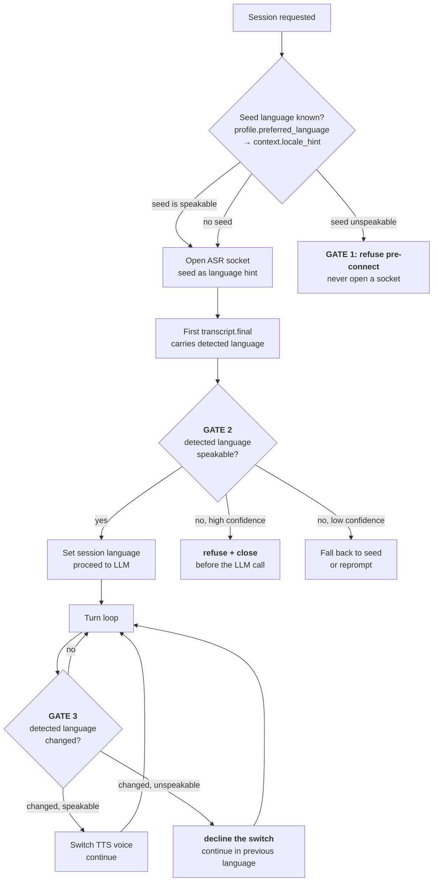

# 06 — The speakability gate: build specification

**What it is.** The check that stops the pipeline from reasoning its way to a reply it has no
voice to speak.

**Why it needs a specification of its own.** Every other failure in this system announces
itself. This one does not. Saaras transcribes all 22 Indian languages *accurately*
([Saaras](https://docs.sarvam.ai/api/getting-started/models/saaras.md)); Bulbul speaks 10 of
them ([Bulbul](https://docs.sarvam.ai/api/getting-started/models/bulbul.md)). Speak Urdu into
the microphone and the ASR succeeds, the LLM produces a good answer, and only the last stage
discovers there is nothing to say it with. The user hears silence.

Scoping those 12 languages out ([ADR 0005](adr/0005-tts-provider-split.md)) changed the
product definition. It did not change what the ASR does when someone speaks Urdu.

---

## 1. The matrix

The gate's only source of truth. Everything else in this document is plumbing around it.

```jsonc
// languages.json — the complete product language set.
// Derived from Bulbul v3, NOT from Saaras. Do not extend without an ADR.
{
  "speakable": [
    { "code": "hi-IN", "name": "Hindi",     "endonym": "हिन्दी" },
    { "code": "bn-IN", "name": "Bengali",   "endonym": "বাংলা" },
    { "code": "ta-IN", "name": "Tamil",     "endonym": "தமிழ்" },
    { "code": "te-IN", "name": "Telugu",    "endonym": "తెలుగు" },
    { "code": "gu-IN", "name": "Gujarati",  "endonym": "ગુજરાતી" },
    { "code": "kn-IN", "name": "Kannada",   "endonym": "ಕನ್ನಡ" },
    { "code": "ml-IN", "name": "Malayalam", "endonym": "മലയാളം" },
    { "code": "mr-IN", "name": "Marathi",   "endonym": "मराठी" },
    { "code": "pa-IN", "name": "Punjabi",   "endonym": "ਪੰਜਾਬੀ" },
    { "code": "or-IN", "name": "Odia",      "endonym": "ଓଡ଼ିଆ" },
    { "code": "en-IN", "name": "English",   "endonym": "English" }
  ],

  // Saaras transcribes these. Nothing in the stack can speak them.
  // Listed explicitly so the gate can distinguish "out of scope" from "unrecognised".
  "heard_not_speakable": [
    "ur-IN", "as-IN", "ne-IN", "kok-IN", "ks-IN", "sd-IN",
    "sa-IN", "sat-IN", "mni-IN", "brx-IN", "mai-IN", "doi-IN"
  ],

  // Used when we must refuse and have no better signal. Hindi has the widest
  // comprehension across the excluded set; en-IN is the final fallback.
  "refusal_ladder": ["hi-IN", "en-IN"]
}
```

**`heard_not_speakable` is deliberately enumerated rather than derived as "everything else".**
It lets the gate tell a supported-language-we-cannot-speak apart from noise, a mis-detection,
or a language Saaras never claimed. Those three deserve different responses, and collapsing
them produces a bot that refuses confidently when it should simply have asked the user to
repeat themselves.

---

## 2. Where it fires

**Three trigger points, not one.** The common mistake is treating this as a session-open
check. It cannot be, because with auto-detection **we do not know the language at session
open** — we learn it from the first utterance.



| Gate | When | Action on failure |
|---|---|---|
| **1 — Pre-connect** | Before opening the ASR socket, on the seed language | Refuse without connecting. Costs nothing, saves a socket against a 20-connection ceiling |
| **2 — First detection** | On the first `transcript.final` carrying a detected language | Refuse and close. **Must fire before the LLM call** |
| **3 — Switch detection** | On every subsequent turn where detected language differs from session language | Decline the switch, continue in the previous language. **Do not end the session** |

### Gate 2 must precede the LLM call

Not merely for latency. Sarvam-105B is capped at **40 requests/minute on Starter**
([rate limits](https://docs.sarvam.ai/api/getting-started/ratelimits)), and that ceiling is
the system's binding concurrency constraint ([ADR 0003](adr/0003-llm.md)). Spending a request
to generate a reply that can never be spoken burns the scarcest resource in the stack to
produce nothing.

### Gate 3 must not end the session

A user who switches into Urdu at turn nine has not made an error. They are mid-conversation
with something they have been talking to for weeks. **Continue in the previous language,
acknowledge the limit once, and carry on.** Terminating is a far worse outcome than a
graceful "I can't manage that one — shall we stay in Hindi?"

Acknowledge **once per session**, not per occurrence. Repeating the apology every time
someone drops an Urdu phrase is its own failure.

---

## 3. Resolving the session language

Ordered. First hit wins.

| # | Source | Notes |
|---|---|---|
| 1 | `user:{uid}:profile.preferred_language` | Sticky preference from prior sessions. Seeds the opening turn — **never a lock** ([02](02-data-contracts.md)) |
| 2 | `JsonContext.identity.locale_hint` | Backend hint. First-session fallback |
| 3 | ASR auto-detection on the first utterance | The authoritative answer. Overwrites the seed |
| 4 | `hi-IN` | Default seed if nothing else is known |

The seed is a **hint for the ASR and a pre-connect gate input only**. Once Gate 2 has a
detected language, that value wins and is written to `sess:{sid}:state.language` with
`language_source: "detected"`.

---

## 4. Types

```ts
type LanguageCode = string;  // BCP-47, e.g. "hi-IN"

type SpeakabilityVerdict =
  | { status: "speakable"; code: LanguageCode }
  | { status: "heard_not_speakable"; code: LanguageCode; confidence?: number }
  | { status: "out_of_scope"; code: LanguageCode }        // non-Indic, or unknown to Saaras
  | { status: "uncertain"; code: LanguageCode | null; confidence?: number };

type GateDecision = {
  verdict: SpeakabilityVerdict;
  gate: 1 | 2 | 3;
  action:
    | "proceed"                 // speakable, continue
    | "refuse_pre_connect"      // gate 1
    | "refuse_and_close"        // gate 2
    | "decline_switch"          // gate 3 — session continues
    | "fallback_to_seed"        // uncertain detection
    | "reprompt";               // uncertain, no usable seed
  /** Language the refusal or acknowledgement is SPOKEN in. Always speakable. */
  respond_in: LanguageCode;
  /** Key into the pre-written refusal copy. Never a literal string. */
  message_key?: string;
};
```

`respond_in` is a required field on every decision, not an optional one. It is the field that
prevents the gate from committing the exact failure it exists to catch — a refusal message
handed to a voice that cannot speak it.

---

## 5. Choosing the language to refuse in

The gate must never emit text in a language Bulbul cannot speak, **including its own error
messages**. Resolution order:

1. `profile.preferred_language`, if speakable
2. The session's previous language, if there was one (Gate 3)
3. `hi-IN` — widest comprehension across the excluded set
4. `en-IN`

**On Hindi as the refusal language for Urdu speakers.** Spoken Hindi and Urdu are broadly
mutually intelligible, so a Hindi refusal will very likely be understood. That is a reason to
use it *for the one-time refusal*. It is **not** a reason to reopen conducting the
conversation in Hindi — [ADR 0005](adr/0005-tts-provider-split.md) rejected substitution, and a
brief "I can't speak that" is a different act from quietly answering someone in a language
they did not choose.

### Refusal copy

Pre-written per language, keyed, never generated. Two message classes:

| Key | Used at | Content |
|---|---|---|
| `gate.unsupported_language` | Gates 1 and 2 | Name what we *can* speak. Do not apologise at length |
| `gate.switch_declined` | Gate 3 | One line, once per session, then continue |

Write these as copy, in all 11 languages, reviewed by native speakers. They are the only
words some users will ever hear from this product, and a machine-translated apology is a bad
first impression.

**Pre-render `gate.unsupported_language` as audio.** Gate 1 fires before any socket is open,
and the [ADR 0005](adr/0005-tts-provider-split.md) TTS-outage path needs pre-rendered audio
anyway. Same asset set, two uses.

---

## 6. Handling code-mixing without false refusals

**The most dangerous bug this gate can introduce.** Hinglish is the product's native register.
A gate that treats an English detection inside a Hindi conversation as a language switch — or
worse, that mis-reads code-mixed audio as an unsupported language — will bounce exactly the
users the product is built for.

Rules:

**Both languages speakable ⇒ never refuse.** Hindi↔English code-mixing is two supported
languages. Gate 3 may switch the TTS voice; it must never decline.

**Never refuse on low confidence.** A `heard_not_speakable` verdict must be *confident*. On
uncertainty, fall back to the seed language or reprompt — never refuse. The asymmetry is
deliberate: transcribing a Hinglish sentence as Hindi is a small error; refusing a Hindi
speaker is a large one.

**Require persistence at Gate 3.** A single turn detected as `ur-IN` inside a Hindi
conversation is more likely a detection artefact than a real switch. Require **two
consecutive** turns before declining a switch. Gates 1 and 2 have no prior context and act on
the first signal.

**Debounce voice switching.** Even between two speakable languages, changing the TTS voice on
every alternating turn will sound broken. Switch on sustained change, not on a single turn.

> **Open dependency.** Confidence-based tolerance assumes `language_probability` is present on
> streaming finals. The Saaras page documents it for the model; the realtime page documents a
> detected `language` field but does not confirm the probability accompanies it
> ([Q1](05-open-questions.md#q1-what-is-the-auto-detect-token-on-saarasv3-realtime-and-does-per-turn-switching-work-on-the-raw-socket),
> [Q4](05-open-questions.md#q4-does-sarvam-streaming-expose-any-asr-confidence)). **Confirm in
> [slice 0](04-milestones.md#slice-0--two-listening-tests-half-a-day-no-product).** If no
> confidence is exposed, substitute the two-consecutive-turns rule at Gate 2 as well and accept
> one wasted turn.

---

## 7. Build order

1. **Ship `languages.json`** and a pure verdict function over it. No I/O, no state — a code
   and an optional confidence in, a `SpeakabilityVerdict` out. Unit-testable in isolation, and
   the one piece that must be exhaustively correct.
2. **Gate 1** in the session-open path, before the ASR socket is created.
3. **Refusal copy and pre-rendered audio** for all 11 languages.
4. **Gate 2** on the first `transcript.final`, positioned **before** the LLM dispatch.
5. **Gate 3** in the turn loop, with the two-consecutive-turns rule and voice-switch debounce.
6. **Telemetry** (§9).

Steps 1–3 are demoable on their own and are the whole of Gate 1.

---

## 8. Test matrix

Exit criteria for [slice 7](04-milestones.md#slice-7--the-speakability-gate).

| Case | Input | Expected |
|---|---|---|
| Accept ×11 | Each speakable language at session open | Session proceeds |
| Refuse ×12 | Each `heard_not_speakable` language | Refusal spoken **in a speakable language**, session closed |
| Non-Indic | French, Korean | `out_of_scope`, refused |
| Gate 1 | Profile seeded `ur-IN` | Refused **without opening an ASR socket** |
| Gate 2 ordering | Urdu first utterance | Refused **with zero LLM requests issued** |
| Gate 3 | Hindi → Urdu at turn 9 | Switch declined, **session continues in Hindi**, acknowledged once |
| Gate 3 repeat | Urdu again at turns 12, 15 | **No repeated apology** |
| **Hinglish** | Heavy Hindi/English code-mixing throughout | **Never refused, never bounced** |
| Speakable switch | Hindi → Tamil → Hindi | Voice switches, no refusal, no session end |
| Low confidence | Ambiguous/noisy audio | Falls back to seed or reprompts — **never refuses** |
| Single-turn artefact | One `ur-IN` detection inside Hindi | Ignored; no decline until two consecutive |
| Refusal language | Urdu speaker, no profile | Refusal spoken in `hi-IN` |
| Cold user | No profile, no `locale_hint` | Seeds `hi-IN`, detection overrides |

**The Hinglish row is the one that matters most.** The other rows fail loudly in testing. That
one fails quietly in production, against the core user.

---

## 9. Telemetry

The gate is also the instrument that tells you whether the scoping decision was right.

| Metric | Why |
|---|---|
| Refusals by language code | **Direct input to the Urdu question.** [ADR 0005](adr/0005-tts-provider-split.md) accepted losing Urdu; this is how you learn what that cost |
| Gate 3 declines per session | High counts suggest either real multilingual users or a mis-tuned detector |
| Low-confidence fallbacks | Rising rate implies detection is degrading — likely on code-mixed audio |
| Refusals where `respond_in` fell through to `en-IN` | Should be rare. Frequent means profiles are not being seeded |

Review refusal-by-language monthly. If Urdu dominates by a wide margin, the second-TTS-vendor
option rejected in [ADR 0005](adr/0005-tts-provider-split.md) deserves reopening — with
evidence rather than speculation.

---

## 10. Anti-patterns

Each of these is a plausible shortcut that produces the exact failure the gate exists to
prevent.

**Gating at the TTS boundary.** Too late. The ASR, LLM and rate-limit budget are already
spent, and there is no graceful recovery left.

**Gating on "is this an Indian language".** The whole problem is that 22 Indian languages are
heard and 11 are spoken. Gate on the **Bulbul matrix**, never on region.

**Deriving the speakable set from Saaras.** They are different lists, from different model
pages, and nothing in Sarvam's documentation links them.

**Refusing in the language you just refused.** Emitting an Urdu apology to a voice with no
Urdu produces silence — the gate committing its own bug.

**Refusing on a single uncertain detection.** Bounces Hinglish speakers, who are the core user.

**Ending the session at Gate 3.** A months-old companion relationship should not end because
someone used an Urdu phrase.

**Hardcoding the matrix in more than one place.** It belongs in `languages.json`, read by the
ASR router, the TTS router and the copy resolver. Three copies will drift, and the drift will
be discovered by a user hearing silence.
